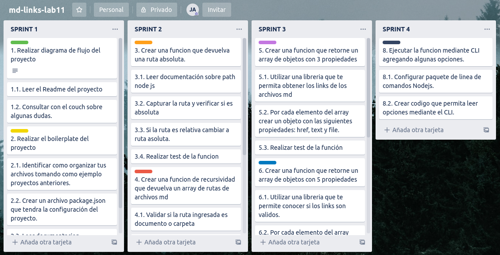

# MD - LINKS - JM

*md-links-jm* es una libreria para archivos de extensión .md

## Tabla de contenidos

* [1. Resumen del proyecto](#1-resumen-del-proyecto)
* [2. Backlog](#2-backlog-del-proyecto)
* [3. Instalación](#3-instalación)
* [4. API](#4-API)
* [5. CLI](#5-CLI) 

***

## 1. Resumen del proyecto

Markdown es un lenguaje de marcado ligero muy popular entre developers. Es usado en muchísimas plataformas que manejan texto plano (GitHub, foros, blogs, ...), y es muy común encontrar varios archivos en ese formato en cualquier tipo de repositorio (empezando por el tradicional README.md).

Estos archivos Markdown normalmente contienen links (vínculos/ligas) que muchas veces están rotos o ya no son válidos y eso perjudica mucho el valor de la información que se quiere compartir.

En este proyecto el objetivo es crear una herramienta usando Node.js, que lea y analice archivos en formato Markdown, para verificar los links que contengan y reportar algunas estadísticas.

## 2. Backlog

  

  [Ver Planificación Trello](https://trello.com/invite/b/7VTjLYZJ/494a8b7b43e2f372089d830cd63f9f50/md-links-lab11)

  [Ver Planificación Github](https://github.com/mishelpa/LIM011-fe-md-links/projects/1)

## 3. Instalación y configuración

Para instalar md-links-jm, debe hacer lo siguiente: 

    npm install --save -dev mishelpa/LIM011-fe-md-links

Crear un archivo .js

```js
// Dentro del archivo creado, colocar
const mdLinks = require('md-links-jm');
 ```

## 4. API

  ### 4.1 Flujograma

  El flujograma muestra el proceso de creación del API. 


### 4.2 Uso

El módulo se puede importar en otros scripts de Node.js y ofrece la siguiente interfaz:

#### `md-Links(path, options)`

#### a) Argumentos

- `path`: el usuario debe colocar una ruta absoluta o relativa al archivo o directorio.
- `options`: Un objeto con las siguientes propiedades:
  * `validate`: Booleano que determina si se desea validar los links encontrados. 

***Cuando options es igual a { validate: true }***

```js
const mdLinks = require('md-links-jm');

mdLinks("./some/example.md", { validate: true })
```

  ***Cuando options es igual a { validate: false }***
  
```js
const mdLinks = require('md-links-jm');

mdLinks("./some/example.md", { validate: false })
```

#### b) Valor de retorno

La función retorna una promesa que resuelve un `Array` de objetos, donde cada objeto representa un link y contiene
las siguientes propiedades:

- `href`: URL encontrada.
- `text`: Texto que aparecía dentro del link (`<a>`).
- `file`: Ruta del archivo donde se encontró el link.

#### Ejemplo

***Cuando options es igual a { validate: true }***

```js
const mdLinks = require('md-links-jm');

mdLinks("./some/example.md", { validate: true })
  .then(data => {
    console.log(data)
  })
  .catch(console.error);
  ```

*Resultado* 

```js
[{  href: 'https://github.com/merunga/pildora-recursion',
    text: 'Pill de recursión - repositorio',
    file: '/home/mishel/Desktop/Laboratoria/LIM011-fe-md-links/src/README.md',
    port: 200,
    status: 'ok' }]

```
***Cuando options es igual a { validate: false }***

```js
const mdLinks = require("md-links-jm");

mdLinks("./some/example.md", { validate: false })
  .then(data => {
    console.log(data)
  })
  .catch(console.error);
```

*Resultado* 

```js
[{  href:'https://github.com/merunga/pildora-recursion',
    text:'Pill de recursión - repositorio',
    file:'/home/mishel/Desktop/Laboratoria/LIM011-fe-md-links/src/README.md' }]
```
## 5. CLI

Tambien se puede ejecutar a traves de la linea de comando.

`md-links <path-to-file> [options]`

### 5.1. Flujograma

El flujograma muestra el proceso de implementar CLI. 


### 5.2 Uso

El ejecutable de la aplicación se ejecuta de la siguiente
manera a través de la terminal:

`md-links <path-to-file> [options]`

Antes de ello debe poner el siguiente comando:

       npm link

En ocasiones nos podemos encontrar con una sorpresa al intentar ejecutar un script en un servidor. El problema/restricción más común es que se nos lance una excepción indicando que:

      «No se puede cargar el archivo XXXX.ps1 porque en el sistema está deshabilitada la ejecución de scripts. Vea «get-help about_signing» para obtener más información».

Por tanto, el error es que en el sistema esta deshabilitada la ejecución de scripts. Si abrimos el Windows PowerShell como administrador y ejecutamos el comando *«Get-ExecutionPolicy»* nos tendría que devolver «Unrestricted» o lo que es lo mismo «Restringido». Para cambiar esta configuración basta con ejecutar **«Set-ExecutionPolicy Unrestricted»**

En ese momento ya se pueden ejecutar scripts sin problemas

##### Options

###### `--validate`

Si pasamos la opción `--validate`, el módulo hace una petición HTTP para
averiguar si el link funciona o no. Si el link resulta en una redirección a una
URL que responde ok, entonces consideraremos el link como ok.

    md-links "./some/example.md" --validate


Por ejemplo:

```
$ md-links "./some/example.md" --validate
./some/example.md http://algo.com/2/3/ ok 200 Link a algo 
./some/example.md https://otra-cosa.net/algun-doc.html fail 404 algún doc
./some/example.md http://google.com/ ok 301 Google
./some/example.md #3-instalación interno null 3. Instalación
```

Vemos que el _output_ en este caso incluye la palabra `ok` o `fail` después de
la URL, así como el status de la respuesta recibida a la petición HTTP a dicha
URL.

Vemos tambien que en la ultima linea incluye `interno` y `null` debido a que el link encontrado en el documento es un hipervinculo al mismo documento por lo cual ya no es necesario hacer una petición HTTP.

##### `--stats`

Si pasamos la opción `--stats` el output (salida) será un texto con estadísticas
básicas sobre los links.

```
$ md-links ./some/example.md --stats
Total: 4
Unique: 4
```

También podemos combinar `--stats` y `--validate` para obtener estadísticas que
necesiten de los resultados de la validación.

```
$ md-links ./some/example.md --stats --validate
Total: 4
Unique: 4
Broken: 1
```
